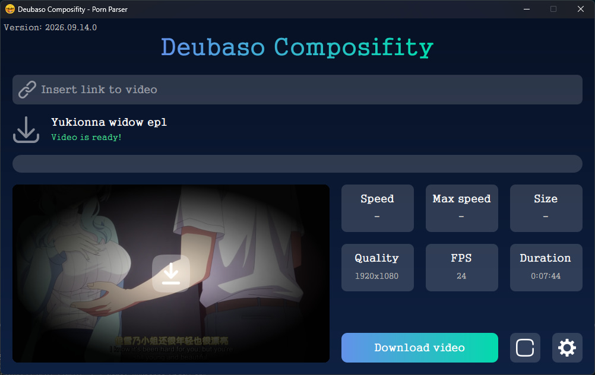
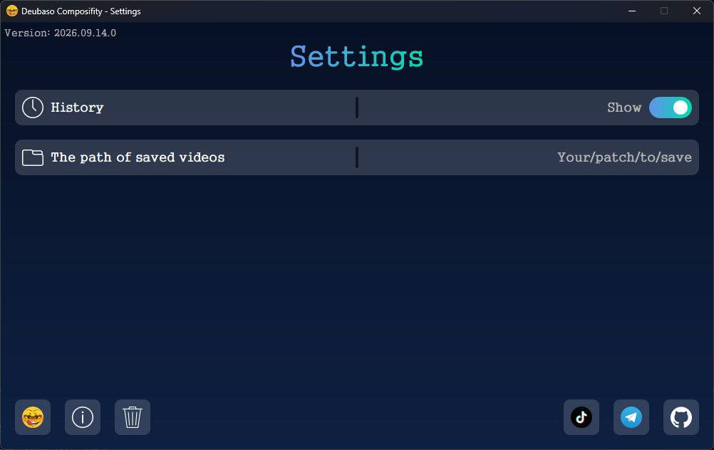
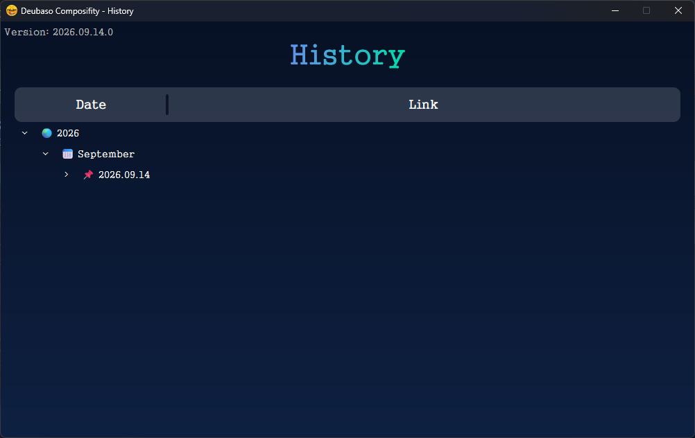
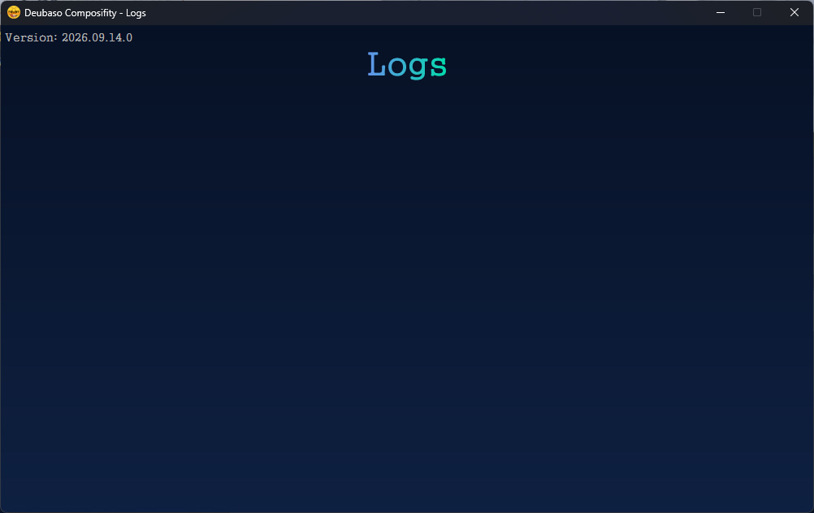

  <h1>Deubaso Composifity</h1>
  
Modern app for downloading videos from 18+ websites. Downloads videos and previews in the best quality.

  
  

---

## Frameworks

Basic frameworks and libraries used in the project:

    

  

---

## Screenshots

| Main window                                                                     | Settings                                                                     |
| ------------------------------------------------------------------------------- | ---------------------------------------------------------------------------- |
|  |  |

| History                                                                    | Logs                                                                 |
| -------------------------------------------------------------------------- | -------------------------------------------------------------------- |
|  |  |

---

## Roadmap

- [ ] Add "Info" functionality
- [ ] Add "Logs" functionality
- [ ] Expand functionality Settings
